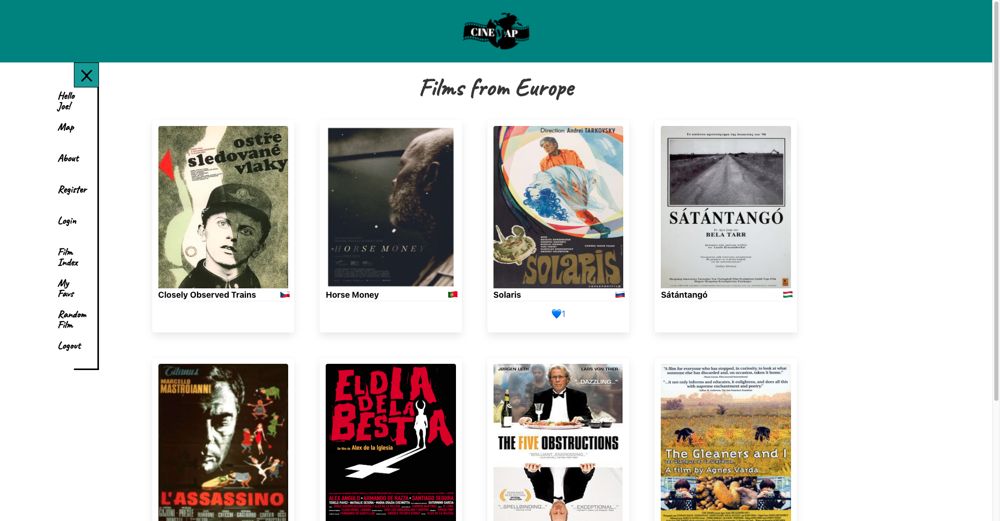
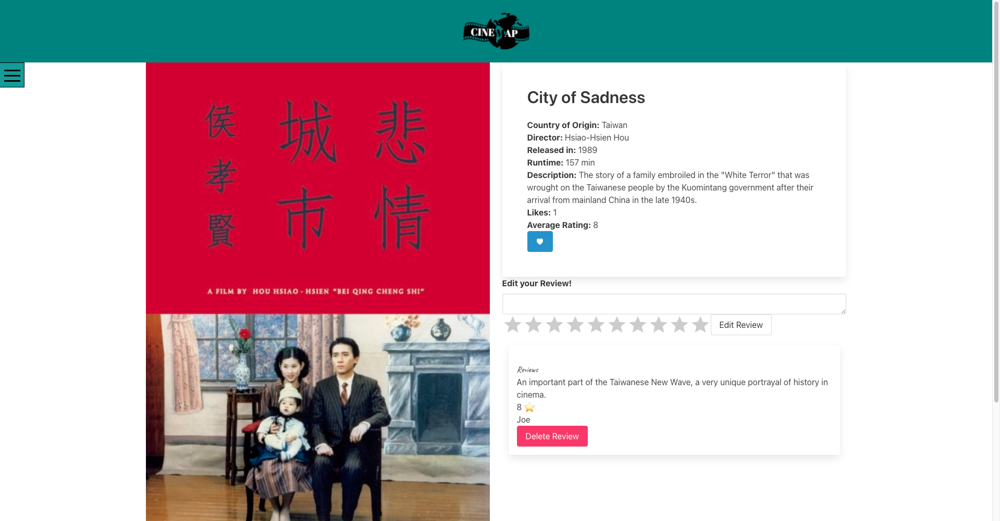
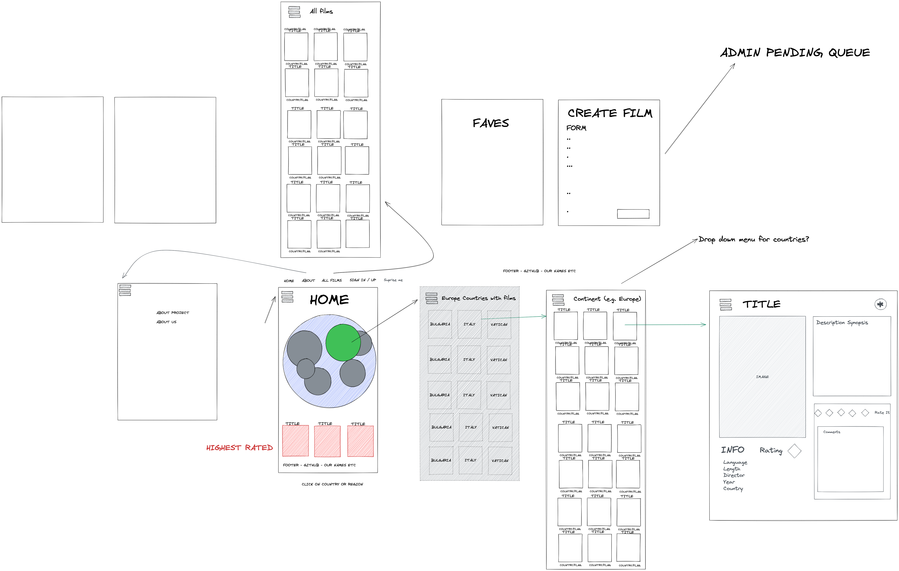
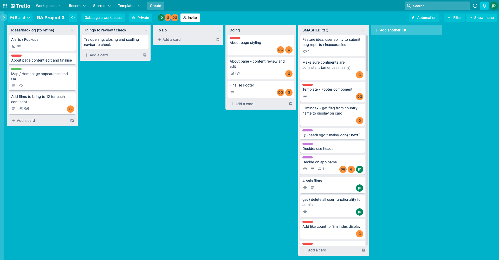

# Cinemap-api

GA SEI Project 3 API

# Project 3

Cinemap is meant to be a website that allows users to navigate through a database of world cinema organised by continent. The site also allows users to submit their own picks for films, and create reviews and likes for the films. The database was made using MongoDB, and the frontend was made using Bulma and React. This was a group project, together with by [Dani Gordon](https://github.com/Dani-Gordon) and [Gabriel Arafa](https://github.com/gabriel-arafa)

**Duration** 7 days.

**Technologies Used** HTML, CSS, Bulma, React, MongoDB, Express.

**LINK**

https://cinemap.netlify.app/

# The Brief

Create a fullstack app using MongoDB and React, the app has to have basic CRUD functionality.

# Site Overview

<p>

</p>
 
<p align="center">


</p>
 
# Preliminary work
 
<p>


</p>
 
# Day 1
 
The first day was mainly spent planning and coming up with the concept. We also decided to use Trello to organise our workflow and Excalidraw for whiteboarding. In terms of the working arrangement, we would work separately, using GitHub for version control, but be on Zoom throughout the day every day so that any issues we had we could collaborate on a solution. We decided to split up responsibilities and put them on Trello, with the idea that once you were done with your task you would move on to others that needed doing. As a result, I ended up working on both backend and frontend as did Dani, with Gabriel contributing to the organisation and about page. I also volunteered to seed that database, as the content was very much interesting to me.  
 
# Day 2
 
I started working on the backend first, starting with the creation of the database. The first model we tackled was the film model, which consisted of two schemas, film and comment. I had to link the comment schema to the film schema in order to allow for reviews to be written for the films, which was an integral part of the app. 
 
```javascript
const commentSchema = new mongoose.Schema({
 text: { type: String, required: true, maxlength: 300 },
 rating: { type: Number, required: true, min: 1, max: 10 },
 createdBy: { type: mongoose.Schema.ObjectId, ref: 'User', required: true },
 username: { type: String, required: true },
});
 
const filmSchema = new mongoose.Schema(
 {
   title: { type: String, required: true },
   country: [{ type: String, required: true }],
   continent: { type: String, required: true },
   language: [{ type: String, required: true }],
   runTime: { type: Number, required: true },
   director: { type: String, required: true },
   releaseYear: { type: Number, required: true },
   description: { type: String, required: true },
   img: { type: String, required: true },
   comments: [commentSchema],
   likedBy: [{ type: mongoose.Schema.ObjectId, ref: 'User' }],
 },
 { timestamps: true }
);
```
 
Once the models working, I started to add basic CRUD operations for the films, starting with GET, DELETE, and POST.
```javascript
const createFilm = async (req, res, next) => {
 try {
   const film = await Film.create(req.body);
   return res.status(201).send({ message: 'Success!', film });
 } catch (e) {
   next(e);
 }
};
```
# Day 3
 
Day 3 was still mainly spent on the backend, adding more operations to the film controller, and I also added a new model for the user. This process was straightforward but time consuming given the nature of authentication and security.
```javascript
const userSchema = new mongoose.Schema({
 username: { type: String, required: true },
 email: {
   type: String,
   required: true,
   unique: true,
   validate: (email) => emailRegex.test(email),
 },
 password: {
   type: String,
   required: true,
   validate: (password) => passwordRegex.test(password),
 },
 isAdmin: { type: Boolean },
 likedFilms: [{ type: mongoose.Schema.ObjectId, ref: 'Film' }],
});
 
userSchema.plugin(uniqueValidator);
 
userSchema.pre('save', function encryptPassword(next) {
 if (this.isModified('password')) {
   this.password = bcrypt.hashSync(this.password, bcrypt.genSaltSync());
 }
 next();
});
 
userSchema.methods.validatePassword = function validatePassword(password) {
 return bcrypt.compareSync(password, this.password);
};
 
userSchema.plugin(
 mongooseHidden({ defaultHidden: { password: true, email: true } })
);
```
 
# Day 4
 
Frontend work started on this day, my main responsibility was to get the Home component working with the focus to be on the world map. This was achieved by using a react-world-map package, and a useEffect hook that navigated to the continent page that is selected from the map. 
```javascript
React.useEffect(() => {
   console.log('selected continent', selected);
   switch (selected) {
     case 'na':
       navigate('/film/continent/North America');
       break;
     case 'sa':
       navigate('/film/continent/South America');
       break;
     case 'eu':
       navigate('/film/continent/Europe');
       break;
     case 'as':
       navigate('/film/continent/Asia');
       break;
     case 'af':
       navigate('/film/continent/Africa');
       break;
     case 'oc':
       navigate('/film/continent/Oceania');
       break;
   }
 }, [selected]);
```
I then started on the FilmIndex and ShowFilm pages.
 
# Day 5
 
The main win for this day was getting a like button working. I started by adding two buttons to the ShowFilm page, one that handled like and one that handled unlike. 
```javascript
const handleLike = async () => {
  const data = await addLikedFilm(filmId);
  setFilm(data);
};
 
const handleUnlike = async () => {
  const data = await removeLikedFilm(filmId);
  setFilm(data);
};
 
```
I broke it down so that we would know that the frontend was successfully talking to the backend. Once I was satisfied with the functionality, I added logic to the handleLikeButton, changed it from two buttons to one, and made it so that the button changed its function based on the liked state of the film. 
```javascript
const handleLikeButton = async () => {
   if (liked === true) {
     const data = await removeLikedFilm(filmId);
     setFilm(data);
     setLiked(false);
   } else {
     const data = await addLikedFilm(filmId);
     setFilm(data);
     setLiked(true);
   }
```
On the page load, a function would check if the film is liked by the user by checking the user’s liked_films array, and depending on the outcome it would set the state of isLiked to true or false. 
 
# Day 6
 
We were able to start on some stretch goals, including a randomFilm page. This required some backend work to add a new api call that we hadn't built yet, and once that was working it was relatively simple to implement on the frontend. The backend work was making a new API call that generated a random film by making another get request, but  this time it also generates a random number based on the amount of films in the database, and skips through the films that many times and then limits the return to one film. 
```javascript
const getRandomFilm = async (req, res, next) => {
 try {
   const numberOfFilms = await Film.find();
   const randomFilm = await Film.find()
     .skip(Math.floor(Math.random() * numberOfFilms.length))
     .limit(1);
   return res.status(200).json(randomFilm);
 } catch (err) {
   next(err);
 }
};
```
The only complicated aspect was making sure that the API call would be made everytime the random film page was navigated to. This was accomplished by using a redirect, so that once the randomFilm is pulled from the API, the page then navigates to the ShowFilm page using the randomFilm's ID.
```javascript
 React.useEffect(() => {
   const getData = async () => {
     const randomFilmObject = await getRandomFilm();
     navigate(`/film/${randomFilmObject[0]._id}`);
   };
   getData();
 }, []);
```
# Day 7
 
This day was mainly spent on bug fixes and small polishes, like adding a better looking component (react-simple-star-rating) for the star rating on the review section on the showFilm page, as well as adding the username to the navbar once they are logged in. I also added a userlist page for users who were admin, as well as permissions for deleting users, films, and reviews. 
 
## Major Hurdles
 
A major hurdle that wasn't really resolved due to the time constraint is the edit function for reviews. It worked, but we struggled to implement it into the frontend in a way that seemed very intuitive. As it stands, the create button changes to an edit button once there is a review present written by the User, and the review needs to be re-written in the textbox rather than the review text changing to an input area which the user can edit and then submit changes from.
 
## Wins
 
A personal win for me was the Random Film page, I enjoyed writing the API call and it was a satisfying solution to make the page essentially a redirect so that users could save the url of the random film they are directed to. It was also satisfying to add the admin level of access, giving users that were admin the ability to delete users, films, and reviews. 
 
## Bugs
When editing a review, no prompt comes up letting the user know they have to rate it again, and the edit won’t work if they don’t also select a rating. In general the editing feature is not very well implemented. 
 
## Key Learnings
 
This project really educated me about group coding. Trello was very useful in assigning tasks and understanding who was doing what at any given moment. I also learned about user access, and how you can secure access on both the backend through using secure routes, or on the frontend by choosing what you display based on user information. I also really appreciated how useful certain React packages can be and how much they add to a website’s functionality and presentation. 
 
## Future Improvements  
 
I would like to improve the editing function on the frontend, and also flesh out the user profile. At the moment it is only a list of likedFilms, but I would also want to add more data about the user, such as films they have reviewed or added. I would also want to flesh out the admin user list, as it is quite bare at the moment. 
 
### Contact Me
Email: JDeering94@gmail.com

[LinkedIn](https://www.linkedin.com/in/joe-deering/)

[Portfolio](https://www.joedeering.co.uk)

Feel free to share feedback or if you are aware of any job opportunities please let me know.
